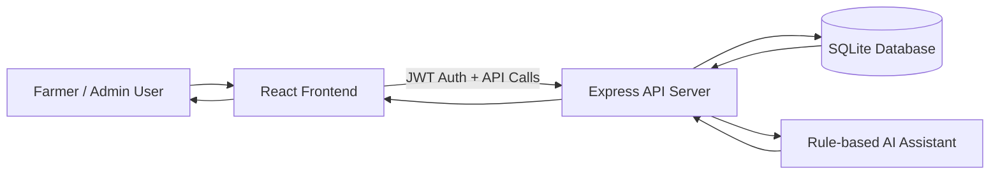
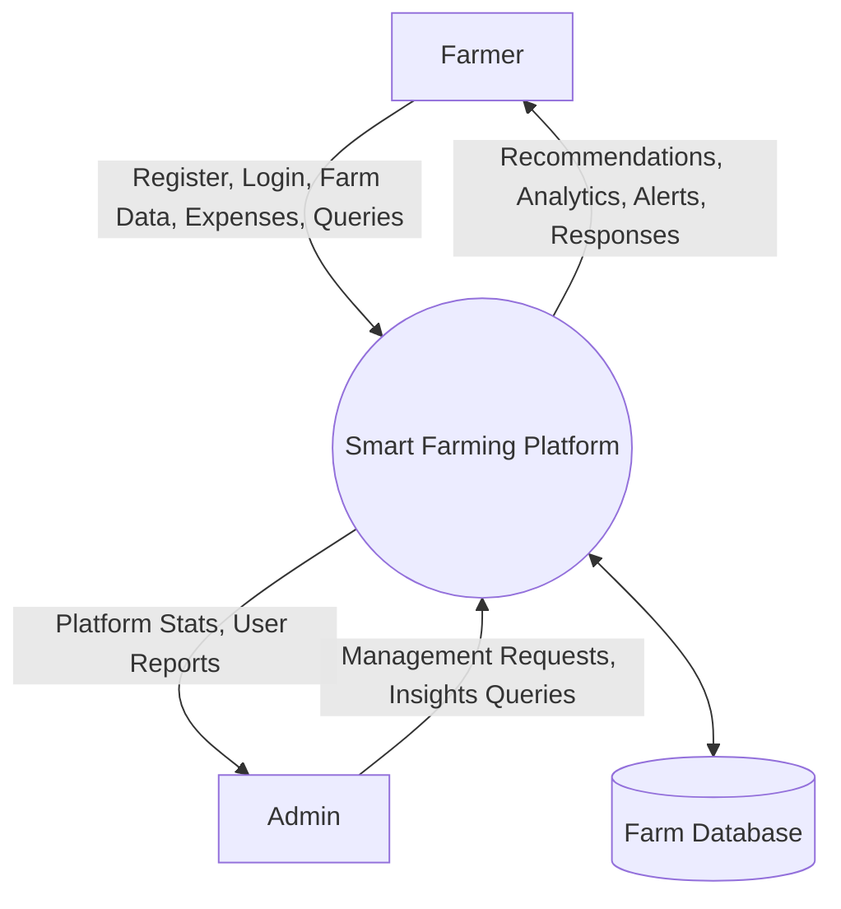
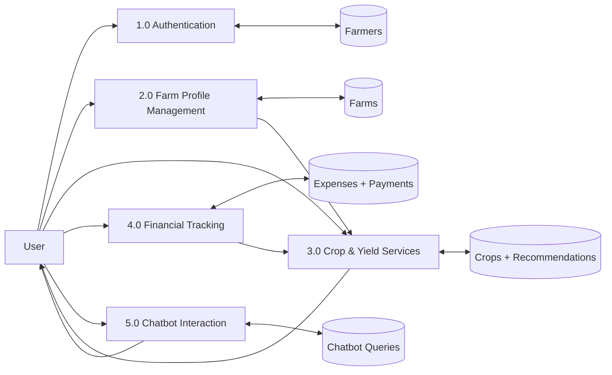
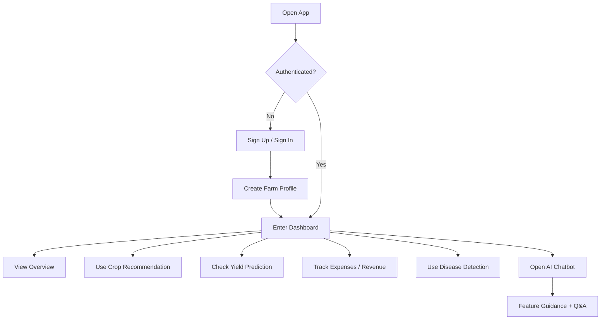

# Smart Farming Platform

Smart Farming Platform is a full-stack agriculture management app built for local development and deployment. It combines a React dashboard with an Express API and SQLite database to help farmers manage farms, track finances, get crop guidance, and use chatbot-assisted workflows.

## 🚀 Deploy Now (Free)

**Easiest:** [Railway](DEPLOY_RAILWAY.md) (one click)  
**Alternative:** [Vercel + Render](DEPLOY_NOW.md) (5 min manual)  
**Local Testing:** [Docker Compose](docker-compose.yml) (`docker-compose up`)

## Project Report Summary

This project focuses on improving farm decision-making through a single digital platform that unifies crop planning, weather awareness, financial tracking, and AI-assisted support. The system is designed for practical daily use by farmers and is implemented with a modular architecture that supports both local deployment and future production scaling.

### Problem Statement

Farm operations are often managed using disconnected tools or manual records, which can lead to delayed decisions, poor traceability of expenses and income, and reduced visibility into crop and weather risks.

### Objectives

- Provide one dashboard for farm profile, crop support, and financial management.
- Improve decision quality through recommendation and prediction modules.
- Offer an accessible chatbot interface for fast feature discovery and guidance.
- Maintain secure user authentication and protected data access.

## Tech Stack

- Frontend: React, TypeScript, Vite, Tailwind CSS
- Backend: Node.js, Express
- Database: SQLite
- Auth: JWT-based authentication

## Core Features

- User sign up and sign in
- Farm profile setup and management
- Dashboard modules:
  - Weather insights
  - Crop recommendations
  - Yield prediction
  - Financial analytics (expenses and revenue)
  - Market prices
  - Disease detection workflow
- Admin panel routes and management APIs
- Integrated farming chatbot

## System Architecture



### Architecture Notes

- Frontend handles UI rendering, authentication state, and module navigation.
- Backend enforces route protection, business logic, and persistence.
- SQLite stores user, farm, financial, recommendation, and chatbot data.
- Chatbot service is integrated as a backend-assisted feature for consistent responses and persistence.

## Data Flow Diagrams (DFD)

### DFD Level 0 (Context Diagram)



### DFD Level 1 (Major Processes)



## User Flow Diagram



## Module-Wise Functional Summary

1. Authentication Module
- Secure sign-up and sign-in with JWT session handling.
- Route guarding for authenticated dashboard access.

2. Farm Setup Module
- Captures farm identity, soil details, and irrigation method.
- Acts as baseline context for recommendations and analytics.

3. Crop Recommendation and Yield Module
- Suggests crop options based on available context and season.
- Displays yield estimation workflows to guide planning.

4. Financial Analytics Module
- Tracks expenses and payments for farm-level insights.
- Supports profitability understanding through visual summaries.

5. Weather and Market Module
- Shows forecast and market-related guidance to support timing decisions.

6. Disease Detection Module
- Provides a guided process for identifying crop disease concerns.

7. AI Chatbot Module
- Offers proactive, topic-driven help and feature discovery.
- Persists user chatbot interactions for continuity.

## Screenshots

### 1. Dashboard Overview


### 2. Financial Analytics Scope


### 3. Same Crop Comparison


### 4. Edit Workflow


## Results and Outcomes

- Unified application flow from onboarding to farm operations.
- Clear separation of frontend, backend, and data layers for maintainability.
- Practical module coverage aligned with common farmer workflows.
- Improved usability through chatbot-led guidance and persistent interaction history.

## Limitations and Future Work

- Recommendation and prediction logic can be enhanced with trained ML models.
- External real-time weather and market APIs can replace sample/mock datasets.
- Mobile-first and offline-first workflows can further increase field usability.

## Project Structure

```text
project/
  src/                # Frontend app (React + TypeScript)
  server/             # Backend API (Express + SQLite)
  supabase/migrations # Initial schema history from earlier setup
```

## Prerequisites

- Node.js 18 or newer
- npm 9 or newer
- VS Code

## Install and Run in VS Code

1. Clone the repository

```bash
git clone https://github.com/arun-19-n/smart-farming-platform.git
```

2. Open the project in VS Code

- Start VS Code
- Go to `File > Open Folder...`
- Select the `project` folder

3. Create environment files

```powershell
Copy-Item .env.example .env
Copy-Item server/.env.example server/.env
```

4. Install frontend dependencies (from `project`)

```bash
npm install
```

5. Install backend dependencies

```bash
cd server
npm install
cd ..
```

6. Run the app in two terminals inside VS Code

Terminal 1 (frontend):

```bash
npm run dev
```

Terminal 2 (backend):

```bash
npm run server:dev
```

7. Open the app

- Frontend: `http://localhost:5173`
- Backend API health: `http://localhost:3001/api/health`

## Useful Scripts

From the root `project` folder:

- `npm run dev` - start Vite frontend
- `npm run build` - build frontend for production
- `npm run preview` - preview production build
- `npm run lint` - run ESLint
- `npm run typecheck` - run TypeScript type checks
- `npm run server` - run backend server
- `npm run server:dev` - run backend with nodemon

From the `project/server` folder:

- `npm start` - start Express server
- `npm run dev` - start Express server with nodemon

## Notes

- The backend creates `server/farm.db` automatically when needed.
- Keep `.env` and `server/.env` private and do not commit them.
- If port 3001 or 5173 is in use, stop the conflicting process or update your env values.